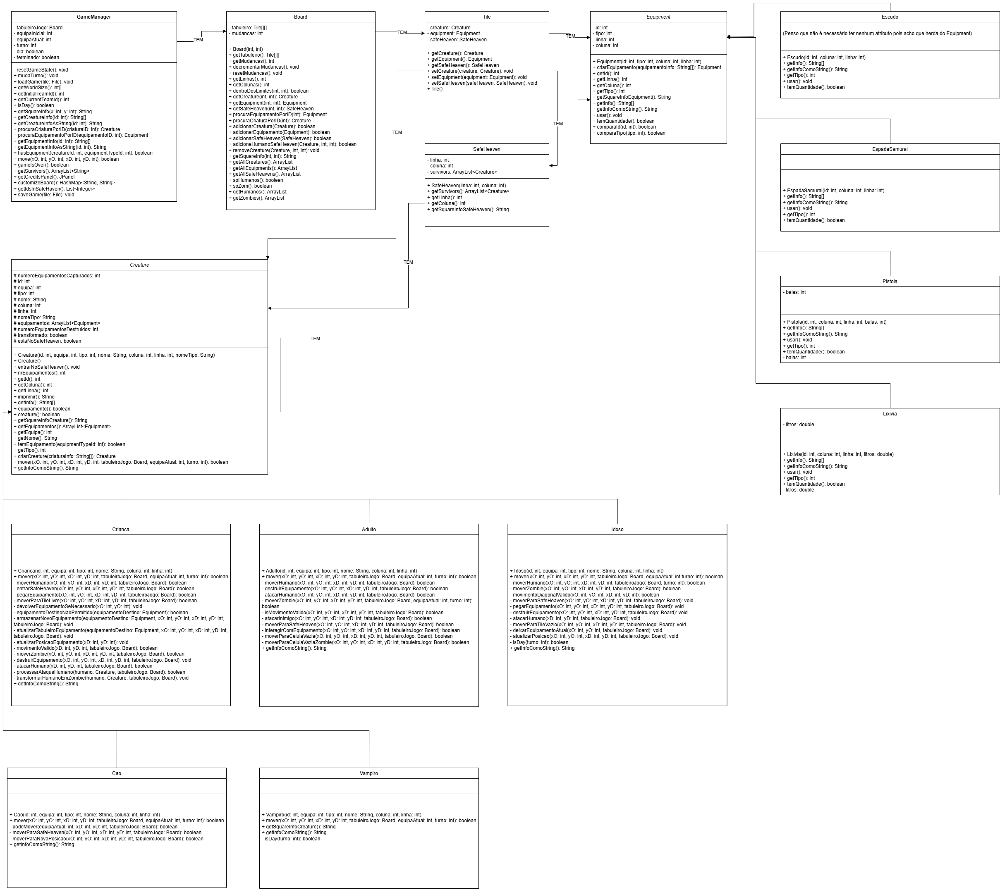

# 🧟‍♂️ The Night of the Living 🧟‍♀️

Welcome to **The Night of the Living**, a **turn-based strategy game** set during a zombie apocalypse. In this game, different entities (humans, zombies, and others) interact within a grid-based world, fighting for survival.

## 📜 About the Game

This project is a **turn-based strategy game**. The core of the project is an engine that processes game turns, where different entities (humans, zombies, and others) interact on a grid-based map. Each entity has its own behavior, abilities, and objectives, and the simulation unfolds until certain victory (or defeat) conditions are met.

## 🏛️ Architecture and Design (UML Diagram)

The game's complete structure, including all classes, their properties, methods, and how they relate to each other, is detailed in the UML diagram below. This diagram serves as the central documentation for understanding the internal logic, game mechanics, and software architecture.

**For details on game mechanics, zombie types, character abilities, and world rules, please consult this diagram:**

## 📁 Repository Structure

* **/src/**: Contains all the Java source code for the simulation engine and game entities.
* **/lib/**: Stores external libraries and dependencies (JARs) required to compile and run the project.
* **/test-files/**: Includes various test scenarios, world maps, and initial configurations used to test the simulation under different conditions.
* `diagrama.png`: The image file for the UML diagram detailing the architecture.

## 🛠️ Technology

* The project is developed entirely in **Java**.

## 🧑‍💻 Authors

This project was developed by:
👨‍💻 Developed by: Nelson Almeida
📅 Version: 1.0
📦 License: MIT
